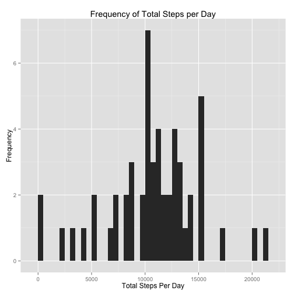
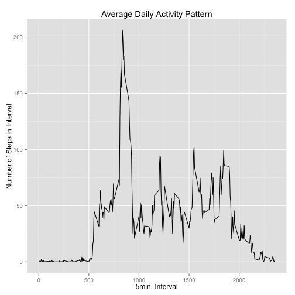
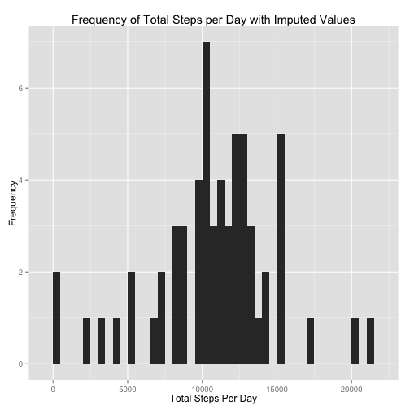
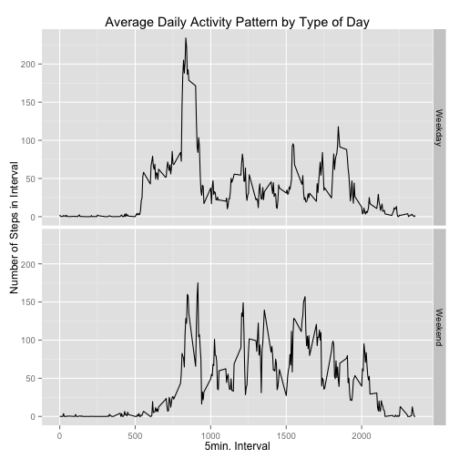

Reproducible Research Peer Assessment #1
========================================

The following report is the analysis and output required for the Reproducible 
Research course Peer Assessment #1. 


```r
## load modules we will use: dplyr, ggplot2
library(dplyr)
library(ggplot2)
```

## Data
The following code is used to load the data and assumes the working directory is 
correctly set.

```r
## load data from csv file
actdata <- read.csv("activity.csv")
## change date from factor to date format
actdata$date <- as.Date(actdata$date, format="%Y-%m-%d")
str(actdata)
```

```
## 'data.frame':	17568 obs. of  3 variables:
##  $ steps   : int  NA NA NA NA NA NA NA NA NA NA ...
##  $ date    : Date, format: "2012-10-01" "2012-10-01" ...
##  $ interval: int  0 5 10 15 20 25 30 35 40 45 ...
```

```r
summary(actdata)
```

```
##      steps             date               interval     
##  Min.   :  0.00   Min.   :2012-10-01   Min.   :   0.0  
##  1st Qu.:  0.00   1st Qu.:2012-10-16   1st Qu.: 588.8  
##  Median :  0.00   Median :2012-10-31   Median :1177.5  
##  Mean   : 37.38   Mean   :2012-10-31   Mean   :1177.5  
##  3rd Qu.: 12.00   3rd Qu.:2012-11-15   3rd Qu.:1766.2  
##  Max.   :806.00   Max.   :2012-11-30   Max.   :2355.0  
##  NA's   :2304
```

```r
head(actdata,3)
```

```
##   steps       date interval
## 1    NA 2012-10-01        0
## 2    NA 2012-10-01        5
## 3    NA 2012-10-01       10
```

```r
tail(actdata,3)
```

```
##       steps       date interval
## 17566    NA 2012-11-30     2345
## 17567    NA 2012-11-30     2350
## 17568    NA 2012-11-30     2355
```

## Mean Total of Number of Steps Per Day
The following code is used to answer the question: "What is the mean total number 
of steps taken per day?"  
First we calculate the total steps taken each day

```r
dailytotalsteps <- actdata %>%
        group_by(date) %>%
        select(date, steps) %>%
        summarize(totalsteps = sum(steps))
str(dailytotalsteps)
```

```
## Classes 'tbl_df', 'tbl' and 'data.frame':	61 obs. of  2 variables:
##  $ date      : Date, format: "2012-10-01" "2012-10-02" ...
##  $ totalsteps: int  NA 126 11352 12116 13294 15420 11015 NA 12811 9900 ...
```

```r
summary(dailytotalsteps)
```

```
##       date              totalsteps   
##  Min.   :2012-10-01   Min.   :   41  
##  1st Qu.:2012-10-16   1st Qu.: 8841  
##  Median :2012-10-31   Median :10765  
##  Mean   :2012-10-31   Mean   :10766  
##  3rd Qu.:2012-11-15   3rd Qu.:13294  
##  Max.   :2012-11-30   Max.   :21194  
##                       NA's   :8
```

```r
head(dailytotalsteps,3)
```

```
## Source: local data frame [3 x 2]
## 
##         date totalsteps
##       (date)      (int)
## 1 2012-10-01         NA
## 2 2012-10-02        126
## 3 2012-10-03      11352
```

```r
tail(dailytotalsteps,3)
```

```
## Source: local data frame [3 x 2]
## 
##         date totalsteps
##       (date)      (int)
## 1 2012-11-28      10183
## 2 2012-11-29       7047
## 3 2012-11-30         NA
```
Next we create a histogram of the total steps taken per day.

```r
with(dailytotalsteps, 
     qplot(totalsteps, 
           main="Frequency of Total Steps per Day", 
           xlab="Total Steps Per Day", 
           ylab="Frequency", 
           geom="histogram", 
           binwidth = 500))
```

 
Finally, we calculate the mean and median total number of steps taken per day.
Mean steps

```r
meandailysteps <- dailytotalsteps %>% summarize(mean(totalsteps, na.rm=TRUE))
```
Median steps

```r
mediandailysteps <- dailytotalsteps %>% summarize(median(totalsteps, na.rm=TRUE))
```


### Answering the question: 
> The mean total number of steps taken per day is roughly 
10766.19 
and the median daily steps are 
10765.  

This lines up with the histogram which shows the bulk of the total steps per day 
count in the range of more than 10,000 steps per day.  

## Average Daily Activity Pattern
The following code is used to answer the question: "What is the average daily 
activity pattern?"  
To start, we graph the time series plot of the steps per interval, averaged 
across all the days (with NA's removed)

```r
dailypattern <- actdata %>% 
    group_by(interval) %>% 
    summarize(meanstep = mean(steps, na.rm=TRUE))

with(dailypattern, 
    qplot(interval, 
          meanstep, 
          geom="line", 
          xlab="5min. Interval", 
          ylab="Number of Steps in Interval", 
          main="Average Daily Activity Pattern"))
```

 
Next, we determine which 5 minute interval has the maximum number of steps, again 
averaged across all the days in the dataset.

```r
maxstepint <- dailypattern %>% arrange(meanstep)
tail(maxstepint,1)
```

```
## Source: local data frame [1 x 2]
## 
##   interval meanstep
##      (int)    (dbl)
## 1      835 206.1698
```
### Answering the question: 
> The activity pattern shows what is likely sleep from midnight until after 5am, a fair amount of activity between roughly 5am until say 7pm with a peak around 8am. The average activity ramps down significantly from roughly the 7pm time until midnight.

The average daily activity pattern shows a very low number of steps (nearly 0) 
for the intervals numbered from 0 thru to 500 (equates to 00:00 until a little 
after 05:00 ), from a little after 500 until a bit before 1000 (a little after 
05:00 until 10:00) the amount of activity ramps up and peaks around 800 to 850 or 
so, the next period from a little before 1000 until a little before 2000 (a 
little after 10:00 until 20:00) sees a decent degree of activity before the 
pattern ramps down from 2000 on (20:00 and on). 

## Imputing Missing Values
The following code is used to determine the answer to the following questions 
when we impute the missing values in the data (coded as NA):  
* Do these values differ from the estimates from the the first part of the assignment? 
* What is the impact of imputing missing data on the estimates of the total daily number of steps?


```r
tableofcounts <- tbl_df(actdata) %>% count(steps, sort=TRUE)
head(tableofcounts, 5)
```

```
## Source: local data frame [5 x 2]
## 
##   steps     n
##   (int) (int)
## 1     0 11014
## 2    NA  2304
## 3     7    87
## 4     8    83
## 5    15    68
```
We see that the number of missing values is 2,304 out of a total 17,568 or 
roughly 13% of the total.  

Next we want to see what the happens when we impute those values. I have 
chosen to use the mean value of an interval for a specific weekday. That is, an 
NA on a Monday at interval 255 is replaced with the mean of the interval 255 
for all Monday's (not including NAs of course).

The following code creates a lookup table of interval by weekday means. First we add two new columns to our data (dayofweek and completestep), then we build our lookup table.

```r
newactdata <- actdata %>% mutate(dayofweek = weekdays(date), completestep=steps)
newactdata$dayofweek <- as.factor(newactdata$dayofweek)
head(newactdata,5)
```

```
##   steps       date interval dayofweek completestep
## 1    NA 2012-10-01        0    Monday           NA
## 2    NA 2012-10-01        5    Monday           NA
## 3    NA 2012-10-01       10    Monday           NA
## 4    NA 2012-10-01       15    Monday           NA
## 5    NA 2012-10-01       20    Monday           NA
```

```r
tail(newactdata,5)
```

```
##       steps       date interval dayofweek completestep
## 17564    NA 2012-11-30     2335    Friday           NA
## 17565    NA 2012-11-30     2340    Friday           NA
## 17566    NA 2012-11-30     2345    Friday           NA
## 17567    NA 2012-11-30     2350    Friday           NA
## 17568    NA 2012-11-30     2355    Friday           NA
```

```r
intbyweekday <- newactdata %>% 
    group_by(interval, dayofweek) %>% 
    summarize(meanstep = mean(steps, na.rm=TRUE))
intbyweekday$dayofweek = as.factor(intbyweekday$dayofweek)
head(intbyweekday,3)
```

```
## Source: local data frame [3 x 3]
## Groups: interval [1]
## 
##   interval dayofweek meanstep
##      (int)    (fctr)    (dbl)
## 1        0    Friday 0.000000
## 2        0    Monday 1.428571
## 3        0  Saturday 0.000000
```

```r
tail(intbyweekday,3)
```

```
## Source: local data frame [3 x 3]
## Groups: interval [1]
## 
##   interval dayofweek meanstep
##      (int)    (fctr)    (dbl)
## 1     2355  Thursday 0.000000
## 2     2355   Tuesday 2.222222
## 3     2355 Wednesday 3.625000
```
Next we will loop through our data and fill out the new "completestep" column with the appropriate values from either the data (steps column if not NA) or from the lookup table. 

```r
##newactdata <- newactdata %>% mutate(completestep = ifelse(is.na(steps), intbyweekday[interval==newactdata$interval & dayofweek==newactdata$dayofweek,]$meanstep, steps))
for(i in seq(nrow(newactdata))){
    if(is.na(newactdata[i,]$steps)){
        newactdata[i,]$completestep <- 
           intbyweekday[
                intbyweekday$interval==newactdata[i,]$interval & 
                intbyweekday$dayofweek==newactdata[i,]$dayofweek,
            ]$meanstep
    } else {
        newactdata[i,]$completestep <- newactdata[i,]$steps
    }
}
head(newactdata,5)
```

```
##   steps       date interval dayofweek completestep
## 1    NA 2012-10-01        0    Monday     1.428571
## 2    NA 2012-10-01        5    Monday     0.000000
## 3    NA 2012-10-01       10    Monday     0.000000
## 4    NA 2012-10-01       15    Monday     0.000000
## 5    NA 2012-10-01       20    Monday     0.000000
```

```r
tail(newactdata,5)
```

```
##       steps       date interval dayofweek completestep
## 17564    NA 2012-11-30     2335    Friday     0.000000
## 17565    NA 2012-11-30     2340    Friday     0.000000
## 17566    NA 2012-11-30     2345    Friday     0.000000
## 17567    NA 2012-11-30     2350    Friday     0.000000
## 17568    NA 2012-11-30     2355    Friday     1.142857
```


```r
dailytotalimputed <- newactdata %>%
        group_by(date) %>%
        select(date, completestep) %>%
        summarize(totalsteps = sum(completestep))
str(dailytotalimputed)
```

```
## Classes 'tbl_df', 'tbl' and 'data.frame':	61 obs. of  2 variables:
##  $ date      : Date, format: "2012-10-01" "2012-10-02" ...
##  $ totalsteps: num  9975 126 11352 12116 13294 ...
```

```r
summary(dailytotalimputed)
```

```
##       date              totalsteps   
##  Min.   :2012-10-01   Min.   :   41  
##  1st Qu.:2012-10-16   1st Qu.: 8918  
##  Median :2012-10-31   Median :11015  
##  Mean   :2012-10-31   Mean   :10821  
##  3rd Qu.:2012-11-15   3rd Qu.:12811  
##  Max.   :2012-11-30   Max.   :21194
```

```r
head(dailytotalimputed,3)
```

```
## Source: local data frame [3 x 2]
## 
##         date totalsteps
##       (date)      (dbl)
## 1 2012-10-01   9974.857
## 2 2012-10-02    126.000
## 3 2012-10-03  11352.000
```

```r
tail(dailytotalimputed,3)
```

```
## Source: local data frame [3 x 2]
## 
##         date totalsteps
##       (date)      (dbl)
## 1 2012-11-28   10183.00
## 2 2012-11-29    7047.00
## 3 2012-11-30   12359.71
```


```r
with(dailytotalimputed, 
     qplot(totalsteps, 
           main="Frequency of Total Steps per Day with Imputed Values", 
           xlab="Total Steps Per Day", 
           ylab="Frequency", 
           geom="histogram", 
           binwidth = 500))
```

 

Mean steps with imputed values

```r
meandailystepsimputed <- dailytotalimputed %>% summarize(mean(totalsteps, na.rm=TRUE))
```
Median steps with imputed values

```r
mediandailystepsimputed <- dailytotalimputed %>% summarize(median(totalsteps, na.rm=TRUE))
```

### Answering the questions: 
> The mean daily steps with imputed values are 
10821.21 and the 
median daily steps are 
11015. This is 
a change of 
55.02 
for the mean and 
250 
for the median.  

## Are there differences in activity patterns between weekdays and weekends?
The following code is used to alter the dataset to include a new factor 
'daytype' which indicates either weekday or weekend. 

```r
typeofdaydata <- newactdata %>% 
    mutate(typeofday = ifelse(
        dayofweek=="Saturday" | dayofweek=="Sunday", "Weekend", "Weekday"))
typeofdaydata$typeofday <- as.factor(typeofdaydata$typeofday)
str(typeofdaydata)
```

```
## 'data.frame':	17568 obs. of  6 variables:
##  $ steps       : int  NA NA NA NA NA NA NA NA NA NA ...
##  $ date        : Date, format: "2012-10-01" "2012-10-01" ...
##  $ interval    : int  0 5 10 15 20 25 30 35 40 45 ...
##  $ dayofweek   : Factor w/ 7 levels "Friday","Monday",..: 2 2 2 2 2 2 2 2 2 2 ...
##  $ completestep: num  1.43 0 0 0 0 ...
##  $ typeofday   : Factor w/ 2 levels "Weekday","Weekend": 1 1 1 1 1 1 1 1 1 1 ...
```

```r
head(typeofdaydata, 5)
```

```
##   steps       date interval dayofweek completestep typeofday
## 1    NA 2012-10-01        0    Monday     1.428571   Weekday
## 2    NA 2012-10-01        5    Monday     0.000000   Weekday
## 3    NA 2012-10-01       10    Monday     0.000000   Weekday
## 4    NA 2012-10-01       15    Monday     0.000000   Weekday
## 5    NA 2012-10-01       20    Monday     0.000000   Weekday
```

```r
tail(typeofdaydata, 5)
```

```
##       steps       date interval dayofweek completestep typeofday
## 17564    NA 2012-11-30     2335    Friday     0.000000   Weekday
## 17565    NA 2012-11-30     2340    Friday     0.000000   Weekday
## 17566    NA 2012-11-30     2345    Friday     0.000000   Weekday
## 17567    NA 2012-11-30     2350    Friday     0.000000   Weekday
## 17568    NA 2012-11-30     2355    Friday     1.142857   Weekday
```
Next we will create a dataset with which we can plot the mean 5-minute intervals 
of steps in the 'imputed' data. 

```r
newdailypattern <- typeofdaydata %>% 
    group_by(typeofday, interval) %>% 
    summarize(meanstep = mean(steps, na.rm=TRUE))

ggplot(newdailypattern) +
    geom_line(mapping=aes(x=interval, y=meanstep)) +
    facet_grid(typeofday ~ .) +
    labs(list(x="5min. Interval", 
          y="Number of Steps in Interval", 
          title="Average Daily Activity Pattern by Type of Day"))
```

 

### Answering the question: 
> By looking at the graphs above, we are able to see there is certainly a 
difference in activity between the average weekend day and weekday. There appears 
to be an earlier wake up time in the week, later time to bed on weekends and a 
higher amount of overall activity on the weekend but a higher peak during the 
week.
